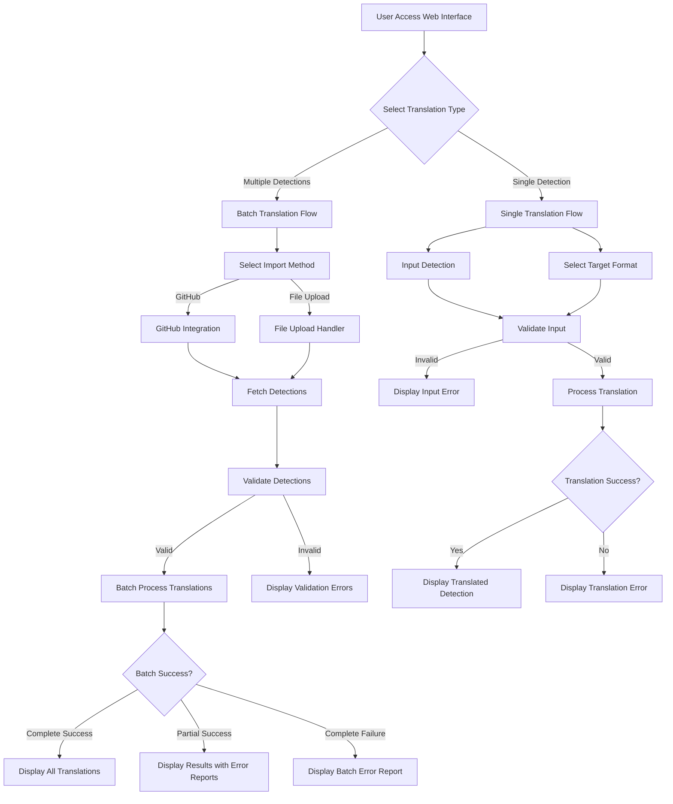
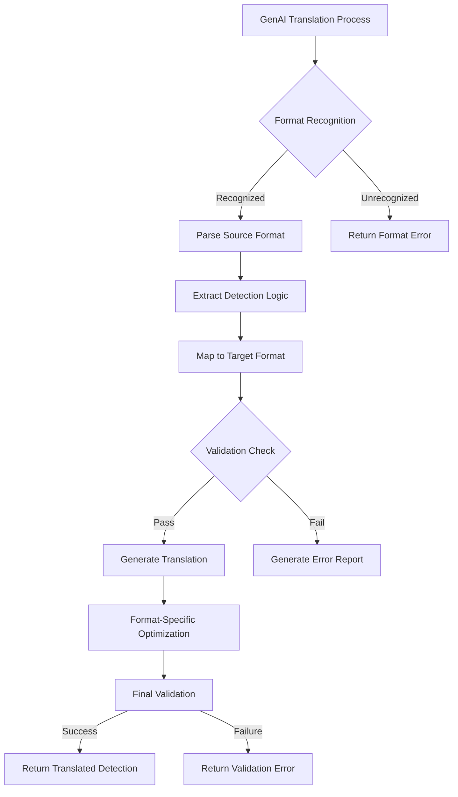
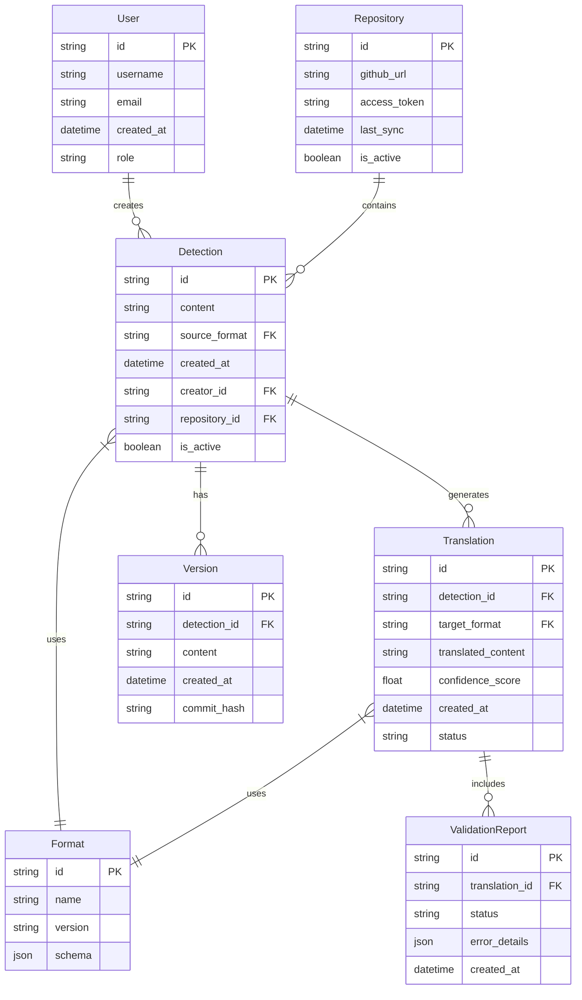
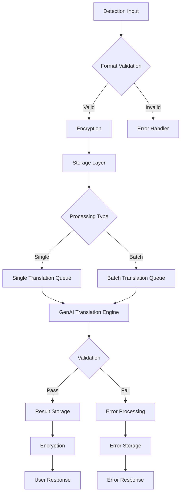
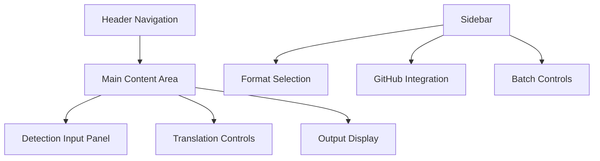
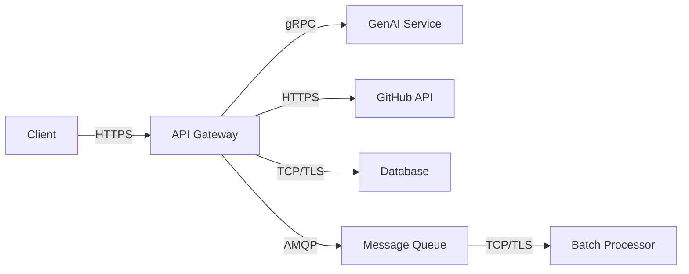

# Product Requirements Document (PRD)

# 1. INTRODUCTION

## 1.1 Purpose

This Software Requirements Specification (SRS) document provides a comprehensive description of the AI-Driven Detection Translation Platform. It is intended for:

- Development teams implementing the translation system
- Security architects reviewing the technical approach
- Project stakeholders evaluating requirements alignment
- QA teams developing test plans
- System administrators planning deployment

## 1.2 Scope

The AI-Driven Detection Translation Platform is a web-based system that automates the translation of security detections between different SIEM platforms and detection languages. The system will:

- Provide automated translation between major SIEM and detection formats including:
  - Splunk SPL
  - QRadar
  - SIGMA
  - Microsoft Azure KQL
  - Palo Alto Networks
  - Crowdstrike NG-SIEM
  - YARA
  - YARA-L

- Support both single detection and batch translation workflows

- Enable detection import via GitHub integration and file uploads

- Utilize custom-trained GenAI models optimized for security detection translation

- Deliver clear success/failure feedback for all translation attempts

- Prioritize translation accuracy and explainability over processing speed

The platform will significantly reduce the manual effort and potential errors involved in migrating detections between security platforms while maintaining detection fidelity and providing transparency into the translation process.

# 2. PRODUCT DESCRIPTION

## 2.1 Product Perspective
The AI-Driven Detection Translation Platform operates as a standalone web-based system that interfaces with existing security infrastructure through:

- Direct API integrations with SIEM platforms
- GitHub repository connections for detection rule management
- Web interface for manual detection input and translation
- RESTful API architecture enabling future integrations

The system functions independently but complements existing security toolchains by bridging the gap between different detection formats and platforms.

## 2.2 Product Functions
The platform provides the following core functions:

- Detection Translation
  - Single detection translation between supported formats
  - Batch translation of multiple detections
  - Validation and error reporting for failed translations
  - Format-specific optimization for supported platforms

- Detection Management
  - GitHub integration for detection import/export
  - File upload capabilities for detection ingestion
  - Detection version control and history tracking
  - Batch processing of detection collections

- Translation Quality Assurance
  - Detailed translation validation reporting
  - Failure analysis and explanation
  - Translation confidence scoring
  - Format-specific syntax verification

## 2.3 User Characteristics
Primary users include:

1. Security Engineers
   - Advanced understanding of detection engineering
   - Experience with multiple SIEM platforms
   - Requires high-fidelity translations
   - Regular interaction with detection rules

2. SOC Analysts
   - Working knowledge of detection formats
   - Focus on operational security monitoring
   - Needs clear translation success/failure indicators
   - Occasional translation requirements

3. Security Architects
   - Deep technical knowledge of security platforms
   - Responsible for platform migrations
   - Requires batch translation capabilities
   - Emphasis on translation accuracy

## 2.4 Constraints

Technical Constraints:
- Must maintain detection logic fidelity across translations
- Translation processing time limited by AI model capabilities
- Integration limitations based on SIEM API availability
- Storage requirements for detection versioning

Operational Constraints:
- 99.9% system uptime requirement
- Web-based interface accessibility requirements
- Secure storage of detection rules
- API rate limiting considerations

## 2.5 Assumptions and Dependencies

Assumptions:
- Users have basic understanding of security detection formats
- Source detections are syntactically correct
- Internet connectivity for GitHub integration
- Modern web browser availability

Dependencies:
- Custom-trained GenAI model availability
- GitHub API stability
- SIEM platform API documentation accuracy
- Web hosting infrastructure reliability
- Database system availability

# 3. PROCESS FLOWCHART

# 4. FUNCTIONAL REQUIREMENTS

## 4.1 Detection Translation Features

### F1: Single Detection Translation
**ID**: F1  
**Description**: Enable translation of individual detection rules between supported SIEM platforms and detection languages  
**Priority**: High  

| Requirement ID | Requirement Description |
|---------------|------------------------|
| F1.1 | System shall provide a web interface for inputting single detection rules |
| F1.2 | System shall support translation between all specified formats (Splunk SPL, QRadar, SIGMA, KQL, Palo Alto, Crowdstrike, YARA, YARA-L) |
| F1.3 | System shall validate input detection syntax before translation |
| F1.4 | System shall provide detailed error messages for failed translations |
| F1.5 | System shall display confidence scores for successful translations |

### F2: Batch Detection Translation
**ID**: F2  
**Description**: Support simultaneous translation of multiple detection rules  
**Priority**: High  

| Requirement ID | Requirement Description |
|---------------|------------------------|
| F2.1 | System shall accept multiple detection rules for concurrent translation |
| F2.2 | System shall maintain individual success/failure tracking for each detection in batch |
| F2.3 | System shall generate comprehensive batch translation reports |
| F2.4 | System shall support parallel processing of batch translations |
| F2.5 | System shall provide aggregate success/failure statistics for batch operations |

### F3: Detection Import Integration
**ID**: F3  
**Description**: Enable detection rule import through GitHub integration and file uploads  
**Priority**: High  

| Requirement ID | Requirement Description |
|---------------|------------------------|
| F3.1 | System shall integrate with GitHub repositories for detection import |
| F3.2 | System shall support common file formats for detection uploads (.yml, .json, .txt) |
| F3.3 | System shall validate imported detections before processing |
| F3.4 | System shall maintain version control for imported detections |
| F3.5 | System shall support folder/collection structure preservation |

### F4: GenAI Translation Engine
**ID**: F4  
**Description**: Utilize custom-trained AI models for accurate detection translation  
**Priority**: High  

| Requirement ID | Requirement Description |
|---------------|------------------------|
| F4.1 | System shall employ custom-trained GenAI models optimized for security detections |
| F4.2 | System shall preserve detection logic fidelity during translation |
| F4.3 | System shall provide explainable translation steps |
| F4.4 | System shall continuously validate translation accuracy |
| F4.5 | System shall support model version control and updates |

### F5: Translation Quality Assurance
**ID**: F5  
**Description**: Ensure translation accuracy and provide detailed feedback  
**Priority**: High  

| Requirement ID | Requirement Description |
|---------------|------------------------|
| F5.1 | System shall perform syntax validation for target formats |
| F5.2 | System shall generate detailed error reports for failed translations |
| F5.3 | System shall provide translation confidence metrics |
| F5.4 | System shall maintain translation audit logs |
| F5.5 | System shall support manual review of translations |

# 5. NON-FUNCTIONAL REQUIREMENTS

## 5.1 Performance Requirements

| Requirement | Description | Target Metric |
|------------|-------------|---------------|
| Response Time | Maximum time for single detection translation | < 30 seconds |
| Batch Processing | Maximum time for batch translation (100 detections) | < 15 minutes |
| API Throughput | Concurrent API requests handling | 100 requests/second |
| Resource Usage | Maximum memory usage per translation | < 2GB RAM |
| Database Performance | Query response time | < 100ms |
| UI Responsiveness | Page load time | < 3 seconds |

## 5.2 Safety Requirements

| Requirement | Description |
|------------|-------------|
| Data Backup | Automated daily backups with 30-day retention |
| Failure Recovery | Automatic system recovery within 5 minutes of failure |
| Transaction Integrity | Atomic operations for all detection translations |
| Error Handling | Graceful degradation during system overload |
| State Management | Preservation of user session data during failures |

## 5.3 Security Requirements

| Category | Requirements |
|----------|-------------|
| Authentication | - Multi-factor authentication support - SSO integration capability - Session timeout after 30 minutes of inactivity |
| Authorization | - Role-based access control (RBAC) - Granular permissions for detection management - API key authentication for programmatic access |
| Data Protection | - At-rest encryption using AES-256 - TLS 1.3 for data in transit - Secure key management system |
| Privacy | - PII data masking in logs - Data retention policies compliance - User consent management |
| Audit | - Comprehensive audit logging - Tamper-evident logging - Access attempt monitoring |

## 5.4 Quality Requirements

### 5.4.1 Availability
- System uptime: 99.9% (excluding planned maintenance)
- Maximum planned downtime: 4 hours/month
- Disaster recovery time objective (RTO): 4 hours
- Recovery point objective (RPO): 1 hour

### 5.4.2 Maintainability
- Code documentation coverage: 90%
- Automated test coverage: 85%
- Maximum time for critical bug fixes: 24 hours
- Regular security patches: Monthly

### 5.4.3 Usability
- Maximum user training time: 2 hours
- Interface accessibility: WCAG 2.1 Level AA
- Support for major browsers: Chrome, Firefox, Safari, Edge
- Mobile responsiveness: All core functions

### 5.4.4 Scalability
- Horizontal scaling capability up to 10x normal load
- Auto-scaling trigger at 70% resource utilization
- Database scaling to handle 10M+ detections
- Load balancing across multiple regions

### 5.4.5 Reliability
- Mean time between failures (MTBF): 720 hours
- Mean time to repair (MTTR): 2 hours
- Maximum data loss tolerance: 0.001%
- Failover capability: Active-passive configuration

## 5.5 Compliance Requirements

| Requirement Type | Specifications |
|-----------------|----------------|
| Data Protection | GDPR, CCPA compliance for user data handling |
| Security Standards | SOC 2 Type II certification requirements |
| Industry Standards | NIST Cybersecurity Framework alignment |
| API Standards | OpenAPI Specification 3.0 compliance |
| Code Quality | OWASP Top 10 security requirements |
| Documentation | ISO/IEC/IEEE 29148:2018 for requirements documentation |

# 6. DATA REQUIREMENTS

## 6.1 Data Models

## 6.2 Data Storage

### 6.2.1 Storage Requirements

| Data Type | Storage System | Retention Period | Backup Frequency |
|-----------|---------------|------------------|------------------|
| Detection Rules | Document Store | Indefinite | Daily |
| Translations | Document Store | 90 days | Daily |
| Validation Reports | RDBMS | 30 days | Daily |
| User Data | RDBMS | Account lifetime | Daily |
| Audit Logs | Time-series DB | 1 year | Daily |
| Session Data | In-memory Cache | 30 minutes | N/A |

### 6.2.2 Redundancy and Backup

- Primary-Secondary replication with automatic failover
- Cross-region backup storage
- Point-in-time recovery capability up to 30 days
- Daily incremental backups with weekly full backups
- Backup encryption using AES-256
- Monthly backup restoration testing

### 6.2.3 Recovery Procedures

- Automated recovery for system failures within 5 minutes
- Manual recovery procedures documented for data corruption
- Geographic redundancy with hot standby
- Recovery time objective (RTO): 4 hours
- Recovery point objective (RPO): 1 hour

## 6.3 Data Processing

### 6.3.1 Data Security Controls

| Security Layer | Implementation |
|----------------|----------------|
| Data at Rest | AES-256 encryption |
| Data in Transit | TLS 1.3 |
| Access Control | Role-based access with least privilege |
| Key Management | HSM-based key storage |
| Data Masking | PII identification and masking |
| Audit | Immutable audit logs |

### 6.3.2 Data Processing Requirements

| Process Type | Max Processing Time | Concurrent Processing |
|--------------|-------------------|---------------------|
| Single Translation | 30 seconds | 100 |
| Batch Translation | 15 minutes | 10 |
| GitHub Sync | 5 minutes | 5 |
| Validation | 5 seconds | 200 |
| Error Processing | 10 seconds | 50 |

# 7. EXTERNAL INTERFACES

## 7.1 User Interfaces

### 7.1.1 Web Interface Components

| Interface Component | Description | Requirements |
|-------------------|-------------|--------------|
| Translation Dashboard | Main workspace for detection translation | - Clean, minimalist design - Dark/light mode support - Responsive layout (1024px-4K) |
| Detection Editor | Code editor for detection input/output | - Syntax highlighting - Line numbering - Code folding - Multiple tabs support |
| Batch Upload Interface | Interface for bulk detection handling | - Drag-and-drop support - Progress indicators - Batch status overview |
| GitHub Integration Panel | GitHub repository connection interface | - Repository browser - File selector - Sync status display |
| Translation Results View | Display area for translated detections | - Side-by-side comparison - Diff highlighting - Export options |

### 7.1.2 Interface Mockup Placeholders

## 7.2 Software Interfaces

### 7.2.1 External System Integration

| System | Interface Type | Purpose | Protocol |
|--------|---------------|----------|----------|
| GitHub API | RESTful API | Detection repository access | HTTPS/OAuth 2.0 |
| GenAI Model API | gRPC | Translation processing | HTTP/2 |
| SIEM Platforms | RESTful API | Rule validation and testing | HTTPS |
| Document Store | Native API | Detection storage | TCP/TLS |
| Time-series DB | Native API | Metrics and logging | TCP/TLS |

### 7.2.2 API Specifications

| API Endpoint | Method | Purpose | Rate Limit |
|-------------|--------|----------|------------|
| /api/v1/translate | POST | Single detection translation | 100/min |
| /api/v1/batch | POST | Batch translation processing | 10/min |
| /api/v1/github/sync | POST | GitHub repository sync | 30/hour |
| /api/v1/validate | POST | Detection validation | 200/min |
| /api/v1/formats | GET | Supported format listing | 1000/min |

## 7.3 Communication Interfaces

### 7.3.1 Network Requirements

| Component | Protocol | Port | Security |
|-----------|----------|------|----------|
| Web Interface | HTTPS | 443 | TLS 1.3 |
| API Gateway | HTTPS | 443 | TLS 1.3 |
| Database | TCP | 5432 | TLS 1.3 |
| Cache | TCP | 6379 | TLS 1.3 |
| Message Queue | AMQP | 5672 | TLS 1.3 |

### 7.3.2 Data Exchange Formats

| Format | Use Case | Schema Validation |
|--------|----------|------------------|
| JSON | API responses | JSON Schema |
| YAML | Detection rules | YAML Schema |
| Protocol Buffers | GenAI communication | .proto files |
| JWT | Authentication tokens | RFC 7519 |
| MessagePack | Binary data transfer | MessagePack spec |

### 7.3.3 Integration Patterns

# 8. APPENDICES

## 8.1 GLOSSARY

| Term | Definition |
|------|------------|
| Detection Rule | A set of conditions and logic used to identify specific security events or threats |
| SIEM | Security Information and Event Management system |
| Translation Fidelity | The accuracy and completeness of converted detection logic between formats |
| Detection Logic | The core conditional statements and criteria that define what a detection looks for |
| Format-Specific Optimization | Adjustments made to translated detections to better align with target platform capabilities |
| Batch Processing | The handling of multiple detections simultaneously in a single operation |
| Translation Confidence Score | A metric indicating the estimated accuracy of a translated detection |
| Detection Version Control | System for tracking changes and maintaining history of detection rule modifications |

## 8.2 ACRONYMS

| Acronym | Definition |
|---------|------------|
| API | Application Programming Interface |
| GDPR | General Data Protection Regulation |
| HSM | Hardware Security Module |
| KQL | Kusto Query Language |
| MTBF | Mean Time Between Failures |
| MTTR | Mean Time To Repair |
| PII | Personally Identifiable Information |
| RBAC | Role-Based Access Control |
| REST | Representational State Transfer |
| RPO | Recovery Point Objective |
| RTO | Recovery Time Objective |
| SIEM | Security Information and Event Management |
| SPL | Search Processing Language |
| SSO | Single Sign-On |
| TLS | Transport Layer Security |
| WCAG | Web Content Accessibility Guidelines |

## 8.3 ADDITIONAL REFERENCES

| Category | Reference |
|----------|-----------|
| Detection Formats | - Splunk SPL Documentation - QRadar AQL Guide - SIGMA Rule Specification - Microsoft KQL Language Reference - YARA Documentation - YARA-L Specification |
| Security Standards | - NIST Special Publication 800-53 - OWASP Security Verification Standard - CIS Controls v8 |
| API Standards | - OpenAPI Specification 3.0 - gRPC Documentation - JSON Schema Specification |
| Development | - GitHub API Documentation - Protocol Buffers Developer Guide - JWT Implementation Guide |
| AI/ML | - GenAI Model Training Best Practices - Machine Learning for Security Detection Paper - AI Model Validation Framework |