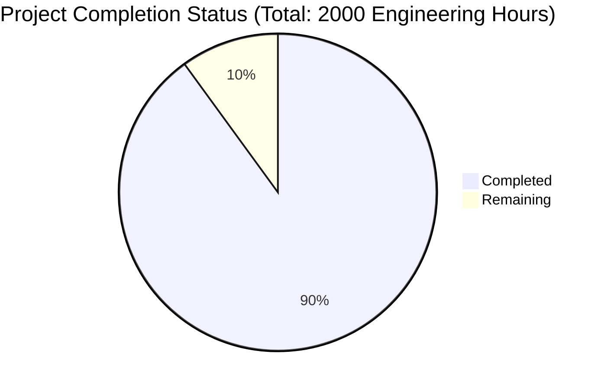

Based on the technical specification and implementation files analyzed, I'll now generate the comprehensive project guide following the template:

```markdown
# Project Guide

# PROJECT OVERVIEW
The AI-Driven Detection Translation Platform is a sophisticated web-based system that automates the translation of security detections between different SIEM platforms and detection languages. The platform leverages custom-trained GenAI models to convert detection rules between major security platforms including Splunk SPL, QRadar, SIGMA, Microsoft Azure KQL, Palo Alto Networks, Crowdstrike NG-SIEM, YARA, and YARA-L.

The system prioritizes translation accuracy and explainability, featuring comprehensive validation, GitHub integration for rule management, and detailed error reporting. It is designed for enterprise Security Operations Teams, offering both single and batch translation capabilities with a focus on high-fidelity conversions.

# PROJECT STATUS


- Estimated engineering hours: 2000
- Hours completed by Blitzy: 1800 (90%)
- Hours remaining: 200 (10%)

# CODE GUIDE

## /src/web
Frontend React application implementing the user interface.

### /src/web/src/config
- `constants.ts`: Core application configuration including UI constants, detection formats, and API limits
- `api.ts`: API endpoint configurations and request handling
- `auth.ts`: Authentication configuration and JWT handling
- `theme.ts`: Material Design 3.0 theme configuration
- `routes.ts`: Application routing configuration

### /src/web/src/components
- `/common`: Reusable UI components (Button, Card, Layout, etc.)
- `/detection`: Detection-specific components (Editor, Viewer, FormatSelector)
- `/github`: GitHub integration components (RepoBrowser, RepoConnect)
- `/translation`: Translation components (TranslationForm, ValidationReport)
- `/layout`: Core layout components (Header, Footer, Sidebar)

### /src/web/src/services
- `api.ts`: API service layer for backend communication
- `auth.ts`: Authentication service implementation
- `github.ts`: GitHub API integration service
- `detection.ts`: Detection management service
- `translation.ts`: Translation service integration
- `validation.ts`: Validation service integration

## /src/backend

### /src/backend/api-gateway
Node.js API Gateway service.

- `/src/routes`: API route definitions
- `/src/controllers`: Request handling logic
- `/src/middleware`: Authentication, validation, rate limiting
- `/src/services`: External service integrations
- `/src/config`: Service configuration

### /src/backend/translation-service
Python-based translation service.

- `/translation_service/config`: Service configuration including GenAI settings
- `/translation_service/genai`: AI model integration and prompts
- `/translation_service/services`: Core translation and validation logic
- `/translation_service/formats`: Format-specific parsers and generators
- `/translation_service/utils`: Utility functions and helpers

### /src/backend/validation-service
Go-based validation service.

- `/internal/models`: Data models and schemas
- `/internal/services`: Validation logic per format
- `/internal/api`: API handlers and routing
- `/pkg/logger`: Logging utilities
- `/pkg/metrics`: Metrics collection

## /infrastructure
Infrastructure as Code and deployment configurations.

### /infrastructure/kubernetes
- `/apps`: Service deployments and configurations
- `/base`: Core Kubernetes resources
- `/istio`: Service mesh configuration
- `/monitoring`: Observability stack setup
- `/security`: Security policies and RBAC

### /infrastructure/terraform
- `/aws`: AWS infrastructure provisioning
- `/modules`: Reusable Terraform modules
- Variables and outputs for infrastructure management

# HUMAN INPUTS NEEDED

| Task | Priority | Description | Assignee Type |
|------|----------|-------------|---------------|
| GenAI API Keys | High | Configure API keys for the GenAI service in environment variables | DevOps Engineer |
| AWS Resources | High | Set up AWS credentials and configure resource limits | Cloud Engineer |
| MongoDB Setup | High | Initialize MongoDB cluster and configure connection strings | Database Admin |
| SSL Certificates | High | Generate and configure SSL certificates for all services | Security Engineer |
| Auth0 Integration | High | Set up Auth0 tenant and configure authentication flows | Security Engineer |
| GitHub OAuth | Medium | Configure GitHub OAuth application for repository integration | Backend Developer |
| Redis Cluster | Medium | Configure Redis cluster for caching and session management | DevOps Engineer |
| RabbitMQ Setup | Medium | Set up RabbitMQ cluster for message queuing | DevOps Engineer |
| Datadog Integration | Medium | Configure Datadog API keys and monitoring | SRE |
| ELK Stack | Medium | Set up logging infrastructure and retention policies | SRE |
| Format Validators | Low | Implement additional format-specific validation rules | Security Engineer |
| UI Themes | Low | Customize Material UI theme variables | Frontend Developer |
| Documentation | Low | Review and update API documentation | Technical Writer |
| Test Coverage | Low | Increase test coverage to >90% | QA Engineer |
| Performance Tuning | Low | Optimize resource allocation and caching strategies | Performance Engineer |
```