# Technical Specifications

# 1. INTRODUCTION

## 1.1 Executive Summary

The AI-Driven Detection Translation Platform is a specialized web-based system designed to automate the complex process of translating security detections between different SIEM platforms and detection languages. By leveraging custom-trained GenAI models, the system addresses the significant challenge of manually converting detection rules when organizations migrate between security platforms or need to maintain consistency across multiple systems.

This solution targets Security Operations Teams, offering automated translation capabilities across major platforms including Splunk SPL, QRadar, SIGMA, Microsoft Azure KQL, Palo Alto Networks, Crowdstrike NG-SIEM, YARA, and YARA-L. The platform prioritizes translation accuracy and explainability over processing speed, ensuring high-fidelity conversions while providing clear feedback on translation success or failure.

## 1.2 System Overview

### Project Context

| Aspect | Description |
|--------|-------------|
| Business Context | Growing need for efficient detection rule migration and cross-platform compatibility in enterprise security operations |
| Current Limitations | Manual translation process is time-consuming, error-prone, and requires deep expertise in multiple SIEM platforms |
| Enterprise Integration | Complements existing security infrastructure through API integrations and GitHub connectivity |

### High-Level Description

| Component | Details |
|-----------|----------|
| Primary Capabilities | - Single and batch detection translation<br>- GitHub integration for rule management<br>- Custom-trained GenAI translation engine<br>- Validation and error reporting |
| Architecture | - Web-based frontend<br>- RESTful API backend<br>- Secure document storage<br>- Advanced GenAI translation engine |
| Technical Approach | - Custom AI models trained on security detections<br>- Format-specific optimization<br>- Comprehensive validation framework<br>- Version-controlled detection management |

### Success Criteria

| Category | Metrics |
|----------|---------|
| Performance | - 99.9% system uptime<br>- Translation accuracy rate >95%<br>- Clear error reporting for failed translations |
| Business Impact | - Reduced detection migration time by 80%<br>- Decreased translation errors by 90%<br>- Improved cross-platform detection coverage |
| User Adoption | - Successful implementation by security teams<br>- Positive user feedback on translation accuracy<br>- Regular usage for detection management |

## 1.3 Scope

### In-Scope Elements

| Category | Components |
|----------|------------|
| Core Features | - Single detection translation<br>- Batch translation processing<br>- GitHub/file upload integration<br>- Translation validation and reporting |
| User Workflows | - Manual detection input and translation<br>- Batch processing via GitHub integration<br>- Detection validation and error review<br>- Translation result export |
| Technical Requirements | - Web interface implementation<br>- API development<br>- AI model integration<br>- Security controls |
| Implementation Boundaries | - Enterprise security teams<br>- Global deployment<br>- Major SIEM platform support<br>- Detection rule management |

### Out-of-Scope Elements

- Custom SIEM platform integrations beyond specified formats
- Real-time detection execution or testing
- Automated detection creation or modification
- Integration with security orchestration platforms
- Detection performance optimization
- Historical detection data migration
- User training and certification programs
- Custom detection format development

# 2. SYSTEM ARCHITECTURE

## 2.1 High-Level Architecture

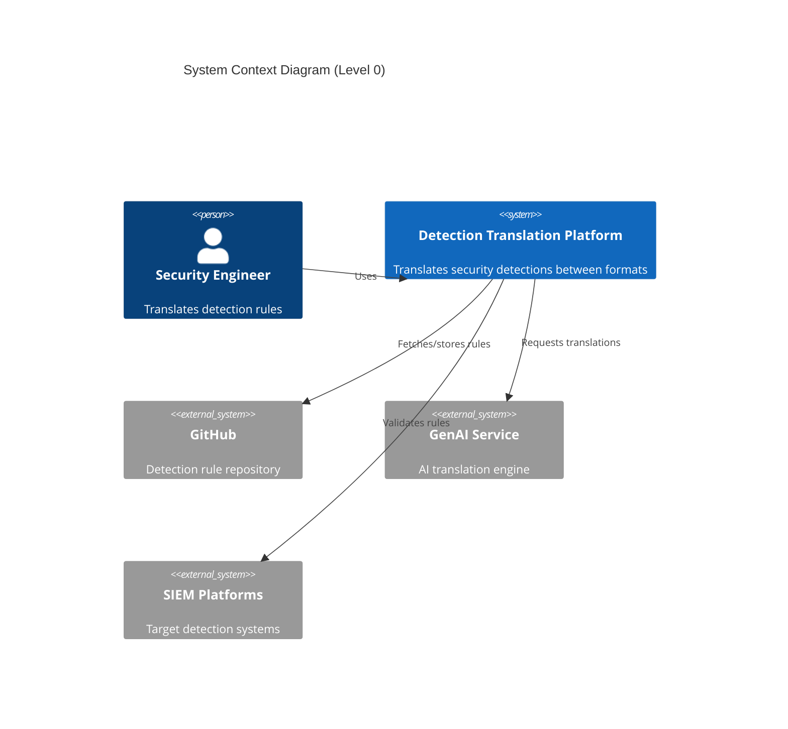

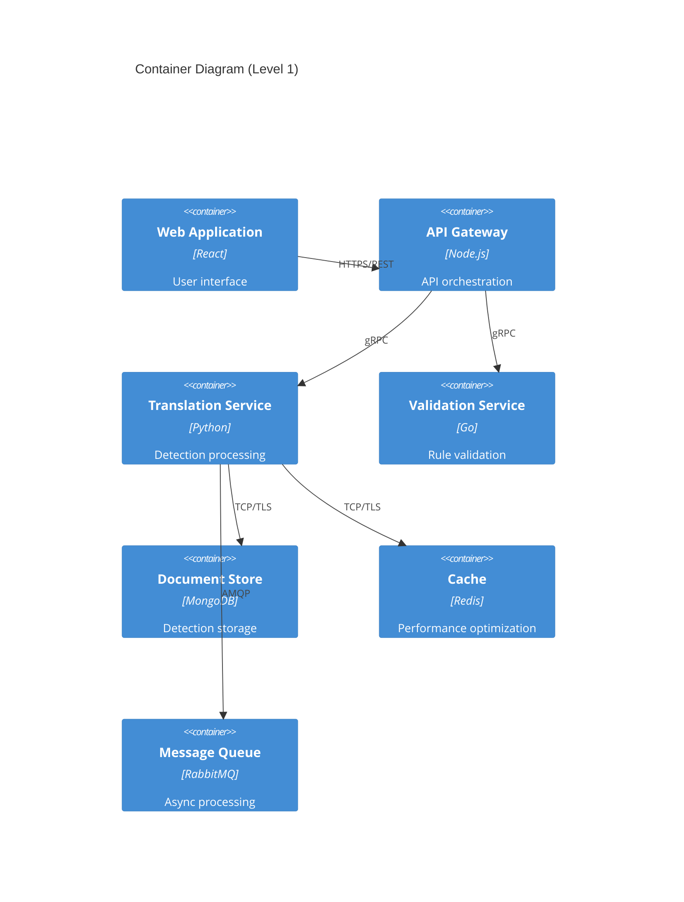

## 2.2 Component Details

### 2.2.1 Core Components

| Component | Purpose | Technology | Scaling Strategy |
|-----------|---------|------------|------------------|
| Web Frontend | User interface and interaction | React, TypeScript | Horizontal scaling with CDN |
| API Gateway | Request routing and authentication | Node.js, Express | Auto-scaling based on load |
| Translation Service | Detection processing and conversion | Python, FastAPI | Horizontal pod autoscaling |
| Validation Service | Rule verification and testing | Go | Horizontal scaling |
| Document Store | Detection and translation storage | MongoDB | Replica sets with sharding |
| Cache Layer | Performance optimization | Redis | Master-replica configuration |
| Message Queue | Asynchronous processing | RabbitMQ | Clustered deployment |

### 2.2.2 Component Architecture

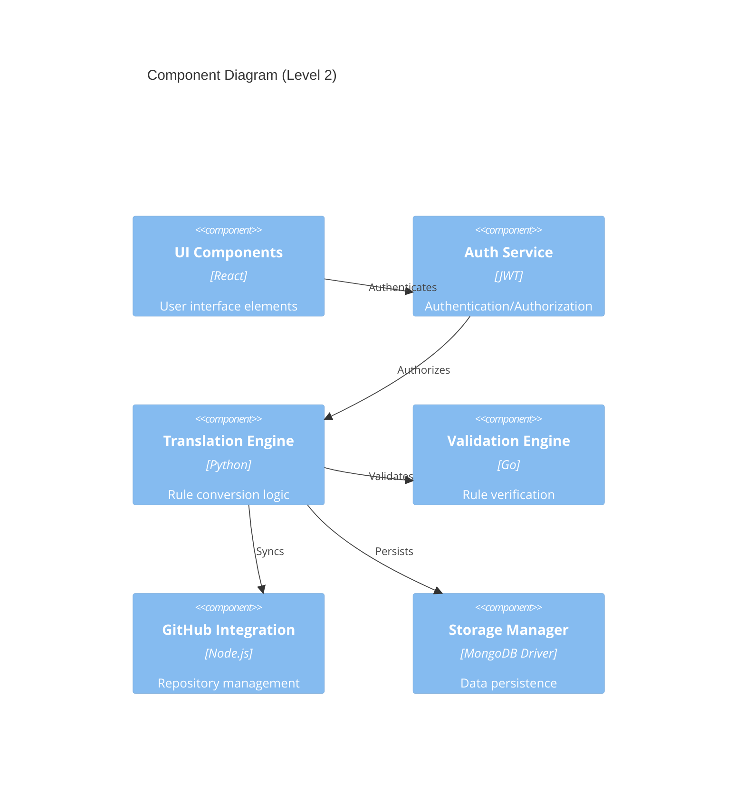

## 2.3 Technical Decisions

### 2.3.1 Architecture Patterns

| Pattern | Implementation | Justification |
|---------|---------------|---------------|
| Microservices | Containerized services | Enables independent scaling and deployment |
| Event-Driven | Message queue integration | Handles asynchronous batch processing |
| API Gateway | Centralized routing | Simplifies client integration and security |
| CQRS | Separate read/write paths | Optimizes query and command operations |
| Circuit Breaker | Service resilience | Prevents cascade failures |

### 2.3.2 Data Flow Architecture

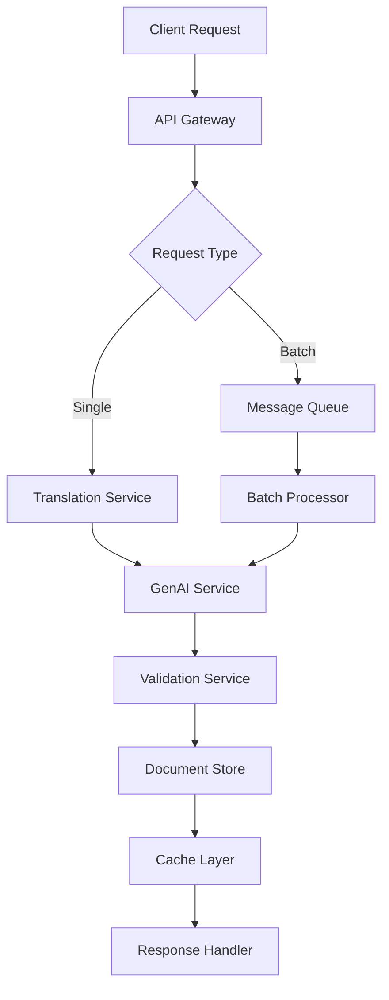

## 2.4 Cross-Cutting Concerns

### 2.4.1 Monitoring and Observability

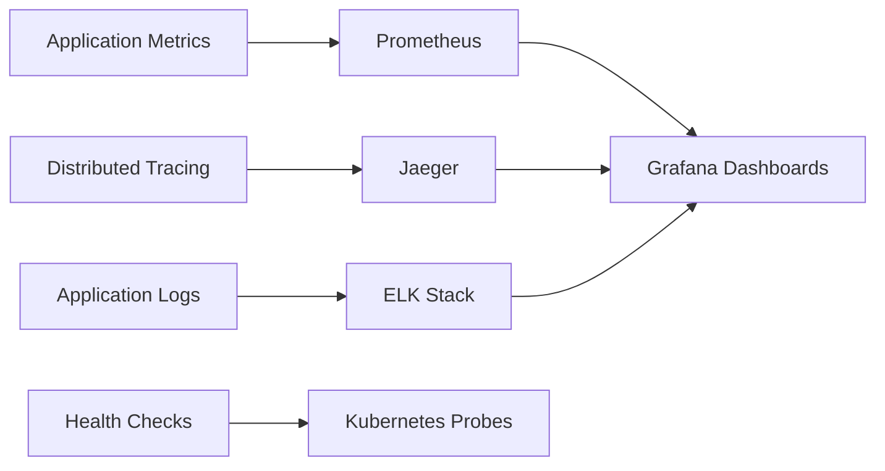

### 2.4.2 Security Architecture

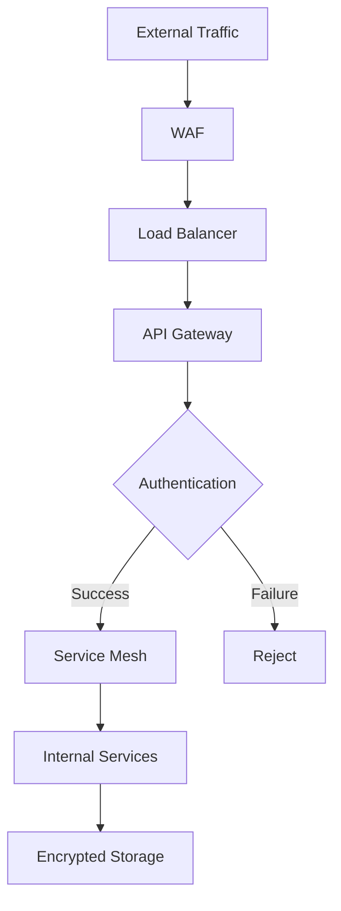

## 2.5 Deployment Architecture

```mermaid
C4Deployment
    title Deployment Diagram
    
    Deployment_Node(cdn, "CDN", "CloudFront"){
        Container(static, "Static Assets")
    }
    
    Deployment_Node(k8s, "Kubernetes Cluster"){
        Container(web, "Web Pods")
        Container(api, "API Pods")
        Container(trans, "Translation Pods")
        Container(valid, "Validation Pods")
    }
    
    Deployment_Node(data, "Data Layer"){
        Container(mongo, "MongoDB Cluster")
        Container(redis, "Redis Cluster")
        Container(queue, "RabbitMQ Cluster")
    }
    
    Rel(cdn, k8s, "HTTPS")
    Rel(k8s, data, "TCP/TLS")
```

### 2.5.1 Infrastructure Requirements

| Component | Specifications | Redundancy |
|-----------|---------------|------------|
| Kubernetes | Production-grade cluster | Multi-zone deployment |
| Load Balancer | Layer 7 with SSL termination | Active-active |
| Data Storage | Distributed cluster | Cross-region replication |
| Cache | In-memory data store | Master-replica |
| Message Queue | Durable message broker | Clustered deployment |
| Monitoring | Full observability stack | High availability |

# 3. SYSTEM COMPONENTS ARCHITECTURE

## 3.1 User Interface Design

### 3.1.1 Design System Specifications

| Component | Specification | Details |
|-----------|--------------|---------|
| Visual Hierarchy | Material Design 3.0 | Consistent spacing, typography, and elevation |
| Component Library | React MUI v5 | Pre-built accessible components with customization |
| Responsive Design | Mobile-first | Breakpoints: 320px, 768px, 1024px, 1440px |
| Accessibility | WCAG 2.1 Level AA | Full keyboard navigation, ARIA labels, screen reader support |
| Browser Support | Modern Browsers | Chrome 90+, Firefox 88+, Safari 14+, Edge 90+ |
| Theme Support | Dark/Light Modes | System preference detection with manual override |
| Internationalization | English Base | RTL support, locale-based formatting |

### 3.1.2 Core Interface Elements

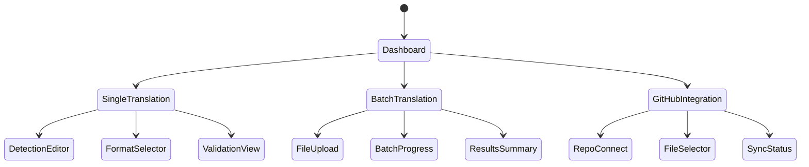

### 3.1.3 Layout Components

| Component | Purpose | Behavior |
|-----------|---------|----------|
| Navigation Bar | Global navigation | Fixed position, collapsible on mobile |
| Detection Editor | Code input/output | Syntax highlighting, line numbers, folding |
| Format Selector | Translation options | Dropdown with format previews |
| Results Panel | Translation display | Split view, diff highlighting |
| Batch Progress | Status tracking | Real-time updates, error indicators |
| GitHub Browser | Repository navigation | Tree view, file preview, branch selection |

## 3.2 Database Design

### 3.2.1 Data Models

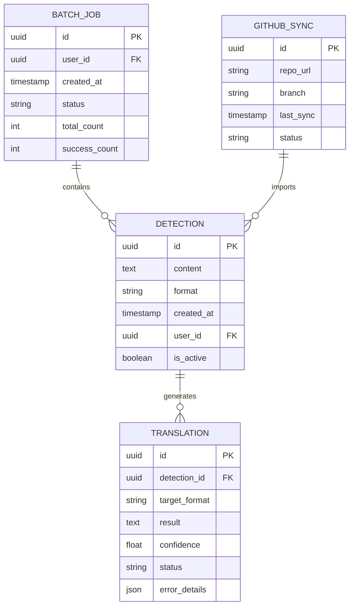

### 3.2.2 Storage Strategy

| Aspect | Implementation | Details |
|--------|---------------|---------|
| Primary Database | PostgreSQL 14+ | Detection storage, relationships, JSONB support |
| Cache Layer | Redis 6+ | Session data, translation results, rate limiting |
| Document Store | MongoDB 5+ | Detection content, translation history |
| Time Series DB | InfluxDB | Metrics, performance data, audit logs |
| File Storage | MinIO | Detection file attachments, batch results |

### 3.2.3 Data Management

| Category | Specification | Implementation |
|----------|--------------|----------------|
| Backup Schedule | Daily full, hourly incremental | Automated with retention policies |
| Data Retention | Detection: Indefinite<br>Translations: 90 days<br>Audit Logs: 1 year | Automated cleanup jobs |
| Archival Strategy | Cold storage after 180 days | AWS S3 Glacier integration |
| Encryption | AES-256 at rest | Database-level encryption |
| Replication | Multi-AZ synchronous | Automatic failover |
| Partitioning | By date and format type | Monthly partitions |

## 3.3 API Design

### 3.3.1 API Architecture

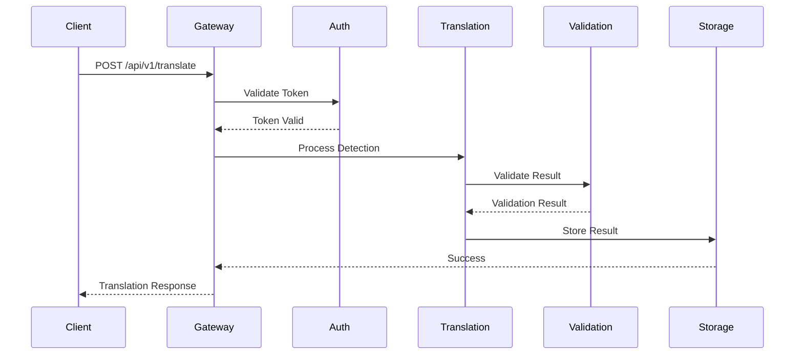

### 3.3.2 API Specifications

| Endpoint | Method | Purpose | Request Format | Response Format |
|----------|--------|---------|----------------|-----------------|
| /api/v1/translate | POST | Single translation | JSON | JSON |
| /api/v1/batch | POST | Batch translation | Multipart | JSON |
| /api/v1/github/sync | POST | GitHub import | JSON | JSON |
| /api/v1/formats | GET | List formats | - | JSON |
| /api/v1/validate | POST | Validate translation | JSON | JSON |

### 3.3.3 Authentication & Security

| Security Layer | Implementation | Details |
|----------------|----------------|---------|
| Authentication | JWT with RSA-256 | 1-hour token expiry |
| Authorization | RBAC with scopes | Fine-grained permissions |
| Rate Limiting | Token bucket | 100 req/min per user |
| API Versioning | URI versioning | v1, v2 support |
| Request Validation | JSON Schema | Pre-processing validation |
| Security Headers | OWASP standards | CSP, HSTS, XSS protection |

### 3.3.4 Integration Patterns

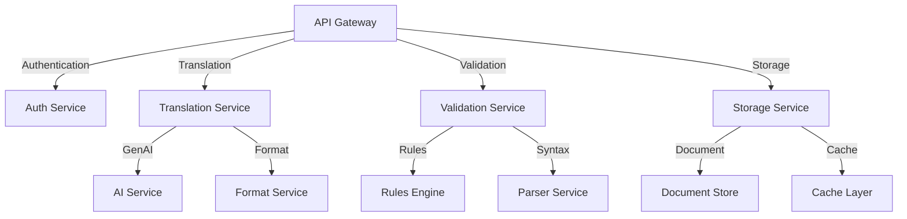

# 4. TECHNOLOGY STACK

## 4.1 PROGRAMMING LANGUAGES

| Component | Language | Version | Justification |
|-----------|----------|---------|---------------|
| Frontend | TypeScript | 5.0+ | Type safety, enhanced IDE support, better maintainability |
| API Gateway | Node.js | 20 LTS | High performance event-driven architecture, extensive package ecosystem |
| Translation Service | Python | 3.11+ | Rich ML/AI libraries, excellent text processing capabilities |
| Validation Service | Go | 1.21+ | High performance, strong concurrency, efficient resource usage |
| Infrastructure | HCL (Terraform) | 1.5+ | Industry standard for IaC, robust provider ecosystem |

## 4.2 FRAMEWORKS & LIBRARIES

### 4.2.1 Frontend Stack

| Framework/Library | Version | Purpose | Justification |
|------------------|---------|---------|---------------|
| React | 18.2+ | UI Framework | Component reusability, virtual DOM performance |
| Material UI | 5.14+ | Component Library | Comprehensive accessible components, customization |
| Redux Toolkit | 1.9+ | State Management | Predictable state updates, dev tools integration |
| React Query | 4.0+ | Data Fetching | Efficient caching, real-time updates |
| Monaco Editor | 0.45+ | Code Editor | Advanced code editing, syntax highlighting |

### 4.2.2 Backend Stack

| Framework/Library | Version | Purpose | Justification |
|------------------|---------|---------|---------------|
| FastAPI | 0.104+ | API Framework | High performance, automatic OpenAPI docs |
| Langchain | 0.0.330+ | AI Integration | Flexible AI model integration, prompt management |
| Express | 4.18+ | Gateway Framework | Mature ecosystem, middleware support |
| Go-Kit | 0.14+ | Microservices | Service mesh compatibility, observability |
| gRPC | 1.59+ | Service Communication | Efficient binary protocol, strong typing |

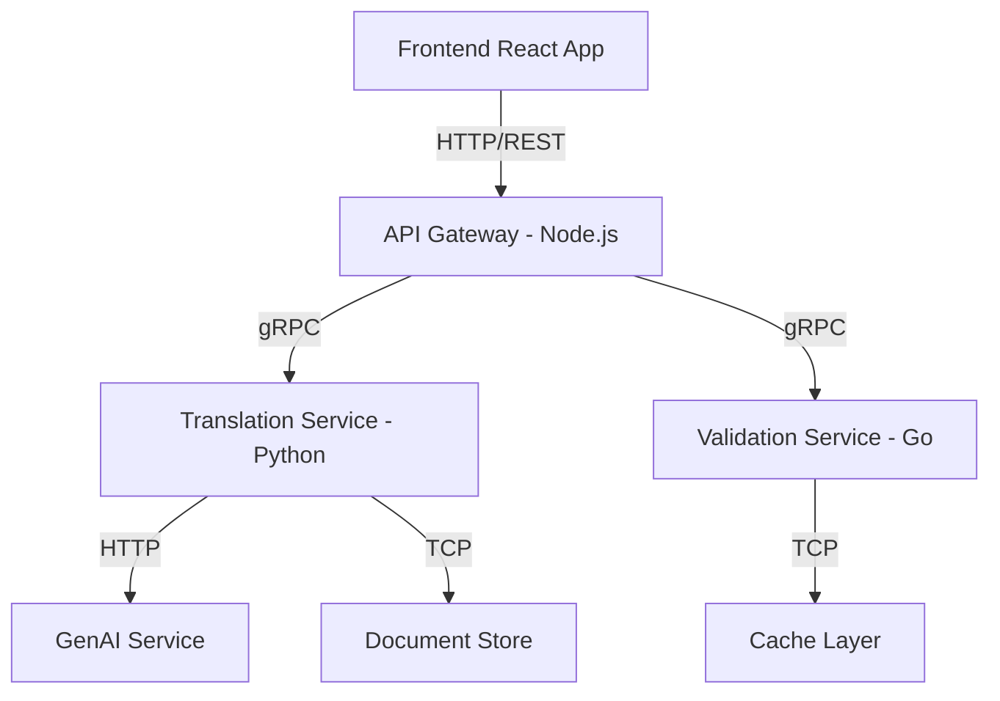

## 4.3 DATABASES & STORAGE

| Type | Technology | Version | Purpose |
|------|------------|---------|----------|
| Document Store | MongoDB | 7.0+ | Detection storage, flexible schema |
| Cache | Redis | 7.2+ | Session data, results caching |
| Time Series | InfluxDB | 2.7+ | Metrics, performance data |
| Object Storage | MinIO | RELEASE.2023-10-25 | File attachments, batch results |
| Message Queue | RabbitMQ | 3.12+ | Async processing, event handling |

### 4.3.1 Data Flow Architecture

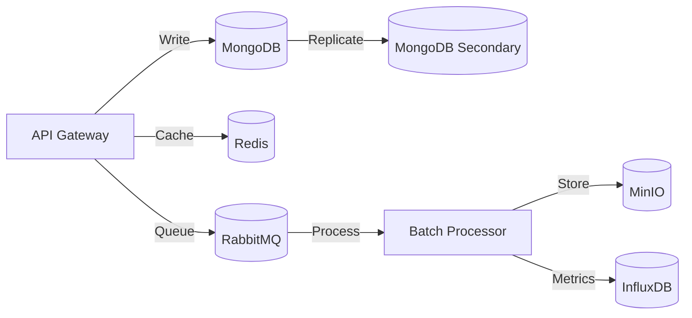

## 4.4 THIRD-PARTY SERVICES

| Service | Purpose | Integration Method |
|---------|---------|-------------------|
| GitHub API | Repository integration | REST API / OAuth 2.0 |
| Auth0 | Authentication | OIDC / JWT |
| AWS KMS | Key management | AWS SDK |
| Datadog | Monitoring & APM | Agent-based |
| Cloudflare | CDN & WAF | DNS / Proxy |

### 4.4.1 Service Dependencies

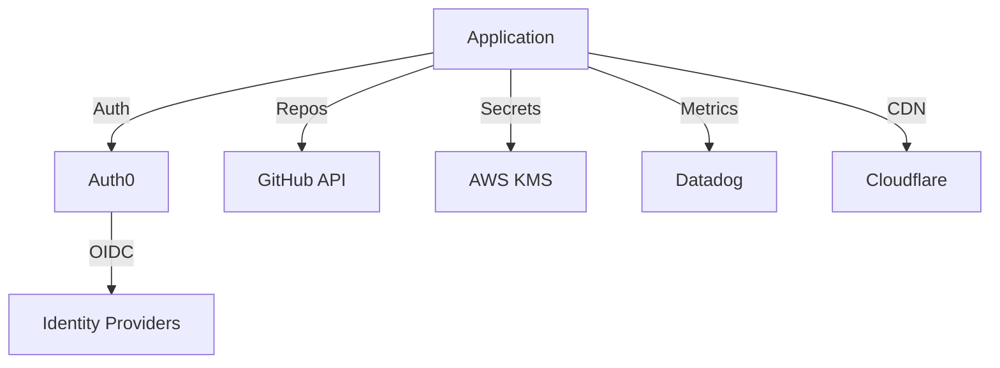

## 4.5 DEVELOPMENT & DEPLOYMENT

### 4.5.1 Development Tools

| Category | Tool | Version | Purpose |
|----------|------|---------|----------|
| IDE | VSCode | Latest | Development environment |
| API Testing | Postman | Latest | API development & testing |
| Containerization | Docker | 24.0+ | Application containerization |
| Container Orchestration | Kubernetes | 1.28+ | Container management |
| CI/CD | GitHub Actions | Latest | Automation pipeline |

### 4.5.2 Deployment Pipeline

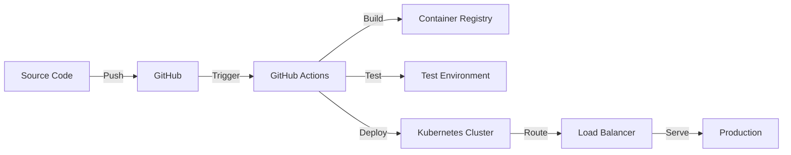

### 4.5.3 Infrastructure Components

| Component | Technology | Version | Purpose |
|-----------|------------|---------|----------|
| Infrastructure as Code | Terraform | 1.5+ | Infrastructure provisioning |
| Service Mesh | Istio | 1.20+ | Service communication |
| Secrets Management | Vault | 1.13+ | Secrets handling |
| Monitoring | Prometheus | 2.47+ | Metrics collection |
| Logging | ELK Stack | 8.10+ | Log aggregation |

# 5. SYSTEM DESIGN

## 5.1 User Interface Design

### 5.1.1 Layout Structure

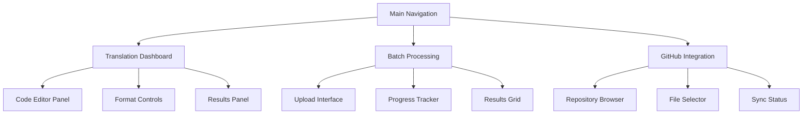

### 5.1.2 Component Specifications

| Component | Layout | Functionality | Technical Implementation |
|-----------|---------|---------------|------------------------|
| Code Editor | Left panel, 60% width | Detection input/output | Monaco Editor with custom syntax highlighting |
| Format Controls | Right sidebar, 20% width | Format selection, options | Material UI Select components |
| Results Panel | Bottom panel, 40% height | Translation display | React-Diff-Viewer with syntax themes |
| Batch Upload | Centered modal, 80% viewport | File handling | React-Dropzone with progress indicators |
| GitHub Browser | Full page overlay | Repository navigation | GitHub API integration with tree view |

### 5.1.3 Responsive Breakpoints

| Breakpoint | Layout Adjustments | Component Behavior |
|------------|-------------------|-------------------|
| Desktop (>1200px) | Three-panel layout | Full functionality |
| Tablet (768-1199px) | Two-panel layout | Collapsible panels |
| Mobile (<767px) | Single panel, stacked | Simplified controls |

## 5.2 Database Design

### 5.2.1 Schema Design

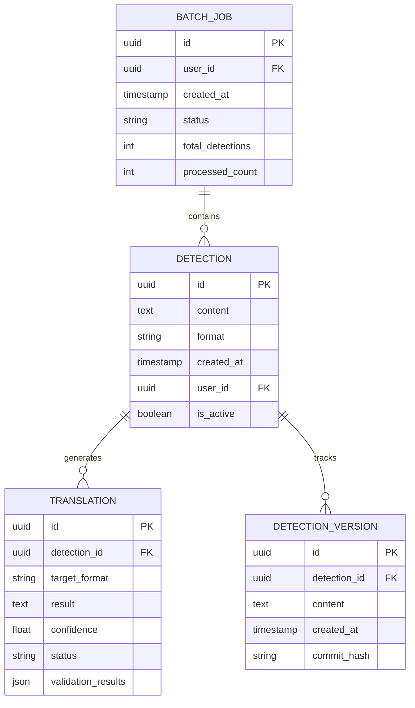

### 5.2.2 Data Storage Strategy

| Data Type | Storage Solution | Indexing Strategy | Backup Policy |
|-----------|-----------------|-------------------|---------------|
| Detections | MongoDB Collection | Content, format, user_id | Daily incremental |
| Translations | MongoDB Collection | detection_id, status | Weekly full |
| Batch Jobs | MongoDB Collection | status, created_at | Daily incremental |
| Versions | MongoDB Collection | detection_id, commit_hash | Weekly full |

## 5.3 API Design

### 5.3.1 RESTful Endpoints

| Endpoint | Method | Purpose | Request/Response Format |
|----------|--------|---------|------------------------|
| /api/v1/detections | POST | Create new detection | JSON |
| /api/v1/translations | POST | Request translation | JSON |
| /api/v1/batch | POST | Start batch job | Multipart/form-data |
| /api/v1/github/sync | POST | Sync GitHub repo | JSON |
| /api/v1/validate | POST | Validate translation | JSON |

### 5.3.2 API Flow

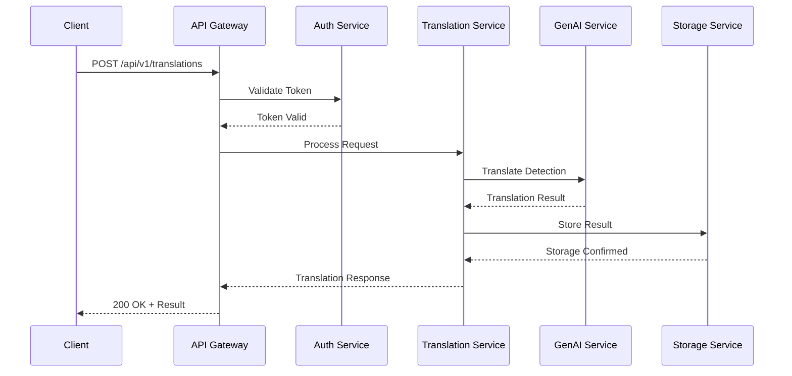

### 5.3.3 Error Handling

| Error Category | HTTP Status | Response Format | Example |
|----------------|-------------|-----------------|---------|
| Validation Error | 400 | JSON with details | Invalid detection format |
| Authentication | 401 | JSON with message | Invalid token |
| Authorization | 403 | JSON with message | Insufficient permissions |
| Resource Error | 404 | JSON with message | Detection not found |
| Server Error | 500 | JSON with trace ID | Processing failure |

### 5.3.4 Rate Limiting

| Endpoint Category | Rate Limit | Time Window | Burst Allowance |
|------------------|------------|-------------|------------------|
| Single Translation | 100 | Per minute | 120 |
| Batch Processing | 10 | Per minute | 15 |
| GitHub Operations | 30 | Per hour | 35 |
| Validation | 200 | Per minute | 250 |

### 5.3.5 API Security

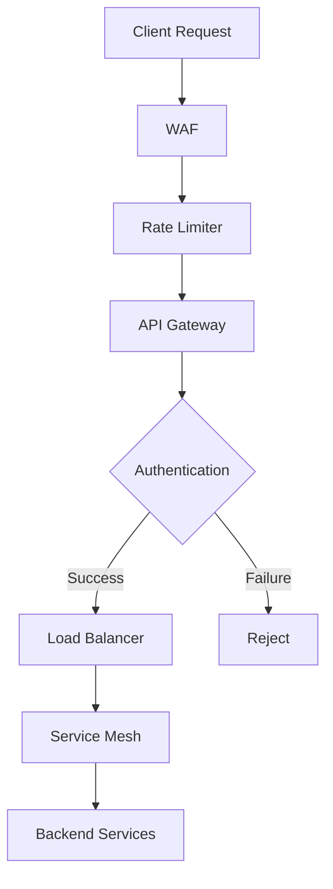

# 6. USER INTERFACE DESIGN

## 6.1 Interface Components Key

```
ICONS                    INPUTS                  CONTAINERS
[?] Help/Info           [...] Text Input        +--+ Border
[$] Payment             [ ] Checkbox            |  | Container
[i] Information         ( ) Radio Button        +-- Tree View
[+] Add/Create          [v] Dropdown            --- Separator
[x] Close/Delete        [====] Progress Bar     >>> Flow Direction
[<] [>] Navigation      [Button] Button
[^] Upload              {Tab} Active Tab
[#] Menu/Dashboard      {-Tab-} Inactive Tab
[@] User Profile        
[!] Warning
[=] Settings
[*] Favorite
```

## 6.2 Main Dashboard

```
+------------------------------------------------------------------------------+
|  [#] Detection Translator    [@] Profile    [?] Help    [=] Settings    [x]   |
+------------------------------------------------------------------------------+
|  {Translation} {-History-} {-Settings-}                                       |
|                                                                              |
|  +--Source Detection--------------------------------+  +-Format Selection--+  |
|  | [...................................................|  | From: [v] Splunk |  |
|  | ....................................................|  | To:   [v] SIGMA |  |
|  | ....................................................|  |                 |  |
|  | [Syntax: SPL]                                      |  | [!] Validation  |  |
|  +------------------------------------------------+  |  | [ ] Auto-Valid  |  |
|  |                                                 |  |  +-----------------+  |
|  | [Clear] [Load Sample] [^] Upload [Translate >] |  |                      |
|  +-------------------------------------------------+                        |
|                                                                              |
|  +--Translation Result--------------------------------+                      |
|  | [...................................................|                      |
|  | ....................................................|                      |
|  | ....................................................|                      |
|  | [Syntax: SIGMA]                                     |                      |
|  +--------------------------------------------------+                      |
|  |                                                   |                      |
|  | [Copy] [Download] [*] Save [!] Validation Report |                      |
|  +---------------------------------------------------+                      |
+------------------------------------------------------------------------------+
```

## 6.3 Batch Translation Interface

```
+------------------------------------------------------------------------------+
|  [#] Detection Translator    [@] Profile    [?] Help    [=] Settings    [x]   |
+------------------------------------------------------------------------------+
|  {-Translation-} {Batch} {-History-}                                          |
|                                                                              |
|  +--Batch Upload----------------------------------------+  +-Statistics----+ |
|  |  [^] Drag and drop files here or click to upload      |  | Total: 25    | |
|  |  +-----------------------------------------------+    |  | Success: 20  | |
|  |  | file1.spl ........................... [x]     |    |  | Failed: 5    | |
|  |  | file2.spl ........................... [x]     |    |  +-------------+ |
|  |  | file3.spl ........................... [x]     |    |                  |
|  |  +-----------------------------------------------+    |  +-Progress----+ |
|  |                                                       |  | [=====>    ] | |
|  |  Target Format: [v] SIGMA                            |  | 65% Complete | |
|  |  [Start Batch >]                                     |  +-------------+ |
|  +-----------------------------------------------------+                  |
|                                                                              |
|  +--Results------------------------------------------------+                |
|  | Filename     | Status  | Actions                         |                |
|  |--------------|---------|----------------------------------|                |
|  | file1.spl    | Success | [View] [Download] [!] Report    |                |
|  | file2.spl    | Failed  | [View] [Download] [!] Report    |                |
|  | file3.spl    | Success | [View] [Download] [!] Report    |                |
|  +------------------------------------------------------+                |
|                                                                              |
|  [Download All] [Export Report] [Clear Batch]                                |
+------------------------------------------------------------------------------+
```

## 6.4 GitHub Integration Panel

```
+------------------------------------------------------------------------------+
|  [#] Detection Translator    [@] Profile    [?] Help    [=] Settings    [x]   |
+------------------------------------------------------------------------------+
|  {-Translation-} {-Batch-} {GitHub}                                           |
|                                                                              |
|  +--Repository Connection---------------------------+  +-Selected Files---+ |
|  |  [Connect to GitHub]                             |  | Total: 12 files  | |
|  |  Current Repo: security-detections               |  | Size: 1.2MB      | |
|  |  Branch: [v] main                               |  +-----------------+ |
|  +-----------------------------------------------+                        |
|                                                                              |
|  +--File Browser----------------------------------------+                    |
|  | +--detections                                        |                    |
|  |   +--splunk                                         |                    |
|  |     |  [ ] detection1.spl                           |                    |
|  |     |  [ ] detection2.spl                           |                    |
|  |   +--sigma                                          |                    |
|  |     |  [ ] alert1.yml                               |                    |
|  |     |  [ ] alert2.yml                               |                    |
|  +--------------------------------------------------+                    |
|                                                                              |
|  Target Format: [v] SIGMA                                                    |
|  [Translate Selected] [Download] [Sync Repository]                           |
+------------------------------------------------------------------------------+
```

## 6.5 Validation Report View

```
+------------------------------------------------------------------------------+
|  [#] Detection Translator    [@] Profile    [?] Help    [=] Settings    [x]   |
+------------------------------------------------------------------------------+
|  Detection Validation Report                                                  |
|                                                                              |
|  +--Summary---------------------------------------------+                    |
|  |  Status: [!] Warning - Minor Issues Found             |                    |
|  |  Confidence Score: 95%                                |                    |
|  |  Original Format: Splunk SPL                          |                    |
|  |  Target Format: SIGMA                                 |                    |
|  +--------------------------------------------------+                    |
|                                                                              |
|  +--Validation Details-----------------------------------+                    |
|  |  [i] Field Mappings                                   |                    |
|  |  +--src_ip ................ Mapped Successfully      |                    |
|  |  +--dest_port ............. Mapped Successfully      |                    |
|  |  +--event_type ............ Warning: Partial Map     |                    |
|  |                                                       |                    |
|  |  [!] Syntax Validation                                |                    |
|  |  +--Line 15: Non-standard field name                 |                    |
|  |  +--Line 23: Recommended index optimization          |                    |
|  +--------------------------------------------------+                    |
|                                                                              |
|  [Export Report] [Return to Translation] [Ignore Warnings]                    |
+------------------------------------------------------------------------------+
```

## 6.6 Responsive Design Breakpoints

| Breakpoint | Layout Adjustments |
|------------|-------------------|
| Desktop (>1200px) | Full three-panel layout with side-by-side comparison |
| Tablet (768-1199px) | Stacked panels with collapsible sections |
| Mobile (<767px) | Single column layout, simplified controls |

## 6.7 Accessibility Features

- WCAG 2.1 Level AA compliance
- High contrast mode support
- Keyboard navigation with visible focus indicators
- Screen reader optimized markup
- Resizable text support up to 200%
- Alternative text for all icons and visual elements

## 6.8 Theme Support

- Light and dark mode themes
- System preference detection
- Custom theme color configuration
- Consistent spacing and typography
- Configurable font sizes and families

# 7. SECURITY CONSIDERATIONS

## 7.1 AUTHENTICATION AND AUTHORIZATION

### 7.1.1 Authentication Methods

| Method | Implementation | Use Case |
|--------|---------------|-----------|
| OAuth 2.0 | Auth0 Integration | Primary user authentication |
| API Keys | JWT-based | Service-to-service authentication |
| MFA | TOTP/SMS | High-privilege operations |
| SSO | SAML 2.0 | Enterprise integration |
| Service Accounts | Certificate-based | GitHub integration |

### 7.1.2 Authorization Model

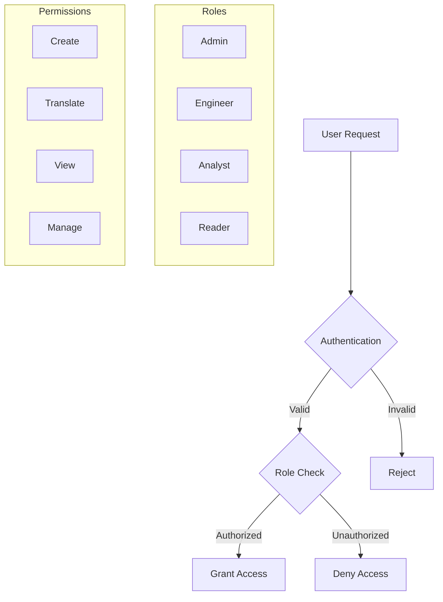

| Role | Permissions |
|------|------------|
| Admin | Full system access, user management, configuration |
| Engineer | Create/edit/translate detections, manage GitHub integration |
| Analyst | Translate detections, view results |
| Reader | View detections and translations |

## 7.2 DATA SECURITY

### 7.2.1 Encryption Standards

| Data State | Method | Key Management |
|------------|--------|----------------|
| At Rest | AES-256-GCM | AWS KMS |
| In Transit | TLS 1.3 | Managed certificates |
| In Memory | Secure memory handling | Runtime encryption |
| Backups | AES-256-CBC | Offline key storage |

### 7.2.2 Data Classification

```mermaid
flowchart LR
    A[Data Input] --> B{Classification}
    B --> C[Detection Rules]
    B --> D[User Data]
    B --> E[System Data]
    B --> F[Audit Logs]
    
    C --> G[Confidential]
    D --> H[Restricted]
    E --> I[Internal]
    F --> J[Protected]
```

| Classification | Security Controls | Retention |
|----------------|------------------|-----------|
| Confidential | Encryption, access logging, MFA | 7 years |
| Restricted | Encryption, access control | 5 years |
| Internal | Standard encryption | 3 years |
| Protected | Immutable storage | 2 years |

## 7.3 SECURITY PROTOCOLS

### 7.3.1 Access Control

```mermaid
sequenceDiagram
    participant User
    participant Gateway
    participant Auth
    participant Service
    participant Audit
    
    User->>Gateway: Request Access
    Gateway->>Auth: Validate Token
    Auth->>Auth: Check Permissions
    Auth-->>Gateway: Authorization Result
    Gateway->>Service: Forward Request
    Service->>Audit: Log Access
    Service-->>User: Response
```

### 7.3.2 Security Monitoring

| Component | Monitoring Type | Alert Threshold |
|-----------|----------------|-----------------|
| API Gateway | Rate limiting | >100 req/min |
| Authentication | Failed attempts | >5 in 5 min |
| Data Access | Unusual patterns | Statistical anomaly |
| System Access | Privilege escalation | Any occurrence |
| File Operations | Unauthorized access | Any attempt |

### 7.3.3 Security Compliance

| Requirement | Implementation | Validation |
|-------------|----------------|------------|
| OWASP Top 10 | Security controls matrix | Quarterly assessment |
| SOC 2 Type II | Control framework | Annual audit |
| GDPR | Data protection measures | Continuous monitoring |
| NIST 800-53 | Security controls | Semi-annual review |

### 7.3.4 Incident Response

```mermaid
stateDiagram-v2
    [*] --> Detection
    Detection --> Analysis
    Analysis --> Containment
    Containment --> Eradication
    Eradication --> Recovery
    Recovery --> PostMortem
    PostMortem --> [*]
```

| Phase | Actions | Responsible Team |
|-------|---------|-----------------|
| Detection | Automated alerts, monitoring | Security Operations |
| Analysis | Threat assessment, impact evaluation | Security Team |
| Containment | System isolation, access control | Operations Team |
| Eradication | Threat removal, patch application | Security Engineering |
| Recovery | Service restoration, validation | Operations Team |
| Post-Mortem | Analysis, documentation, improvements | All Teams |

# 8. INFRASTRUCTURE

## 8.1 DEPLOYMENT ENVIRONMENT

### 8.1.1 Environment Strategy

| Environment | Purpose | Configuration |
|-------------|---------|---------------|
| Development | Feature development, testing | Single-region, minimal redundancy |
| Staging | Pre-production validation | Multi-AZ, production-like |
| Production | Live system operation | Multi-region, full redundancy |

### 8.1.2 Infrastructure Architecture

```mermaid
flowchart TD
    subgraph Cloud Infrastructure
        LB[Load Balancer] --> K8S[Kubernetes Cluster]
        K8S --> DB[(Database Cluster)]
        K8S --> Cache[(Redis Cluster)]
        K8S --> Queue[(RabbitMQ Cluster)]
        
        subgraph Kubernetes Cluster
            API[API Pods]
            Web[Web Pods]
            Trans[Translation Pods]
            Valid[Validation Pods]
        end
    end
    
    CDN[CloudFront CDN] --> LB
    Users[Users] --> CDN
    GitHub[GitHub] --> K8S
```

## 8.2 CLOUD SERVICES

| Service | Provider | Purpose | Justification |
|---------|----------|---------|---------------|
| EKS | AWS | Kubernetes management | Managed container orchestration with high availability |
| RDS | AWS | Database hosting | Managed PostgreSQL with automated backups |
| ElastiCache | AWS | Redis cluster | Managed caching with replication |
| CloudFront | AWS | CDN | Global content delivery with edge caching |
| S3 | AWS | Object storage | Scalable storage for detection files |
| KMS | AWS | Key management | Secure key storage and rotation |
| CloudWatch | AWS | Monitoring | Integrated metrics and logging |
| Route53 | AWS | DNS management | Global DNS with health checking |

## 8.3 CONTAINERIZATION

### 8.3.1 Container Strategy

```mermaid
graph TD
    A[Base Images] --> B[Service Images]
    B --> C[Development Images]
    B --> D[Production Images]
    
    subgraph Base Images
        E[Node.js]
        F[Python]
        G[Go]
    end
    
    subgraph Service Images
        H[API Service]
        I[Web Frontend]
        J[Translation Service]
        K[Validation Service]
    end
```

### 8.3.2 Container Specifications

| Service | Base Image | Resource Limits | Health Checks |
|---------|------------|-----------------|---------------|
| Web Frontend | node:20-alpine | CPU: 1, Memory: 2Gi | HTTP /health |
| API Gateway | node:20-alpine | CPU: 2, Memory: 4Gi | HTTP /status |
| Translation Service | python:3.11-slim | CPU: 4, Memory: 8Gi | HTTP /ready |
| Validation Service | golang:1.21-alpine | CPU: 2, Memory: 4Gi | HTTP /health |

## 8.4 ORCHESTRATION

### 8.4.1 Kubernetes Configuration

```mermaid
graph TD
    subgraph Kubernetes Cluster
        A[Ingress Controller] --> B[Service Mesh]
        B --> C[Pod Security Policies]
        
        subgraph Workloads
            D[Deployments]
            E[StatefulSets]
            F[DaemonSets]
        end
        
        subgraph Services
            G[ClusterIP]
            H[LoadBalancer]
            I[NodePort]
        end
    end
```

### 8.4.2 Cluster Specifications

| Component | Configuration | Scaling Policy |
|-----------|--------------|----------------|
| Worker Nodes | r6g.2xlarge | Auto-scaling (2-10 nodes) |
| Control Plane | Managed EKS | Multi-AZ deployment |
| Node Groups | Production/System | Zone-balanced distribution |
| Storage Classes | gp3-encrypted | Dynamic provisioning |

## 8.5 CI/CD PIPELINE

### 8.5.1 Pipeline Architecture

```mermaid
flowchart LR
    A[Source Code] -->|Push| B[GitHub]
    B -->|Trigger| C[GitHub Actions]
    
    subgraph CI Pipeline
        C -->|Build| D[Container Build]
        D -->|Test| E[Unit Tests]
        E -->|Analyze| F[Code Quality]
        F -->|Scan| G[Security Scan]
    end
    
    subgraph CD Pipeline
        G -->|Deploy| H[Dev Environment]
        H -->|Promote| I[Staging]
        I -->|Approve| J[Production]
    end
    
    J -->|Monitor| K[Observability]
```

### 8.5.2 Pipeline Stages

| Stage | Tools | Actions | Success Criteria |
|-------|-------|---------|------------------|
| Build | Docker | Container image creation | Build success, size limits |
| Test | Jest, PyTest, Go Test | Unit/Integration tests | 90% coverage, all tests pass |
| Quality | SonarQube | Code analysis | No critical issues |
| Security | Snyk, Trivy | Vulnerability scanning | No high/critical vulnerabilities |
| Deploy | ArgoCD | Kubernetes deployment | Health check success |
| Monitor | Datadog | Performance monitoring | No critical alerts |

### 8.5.3 Deployment Strategy

| Environment | Strategy | Rollback Plan | Validation |
|-------------|----------|---------------|------------|
| Development | Direct deployment | Automatic revert | Basic health checks |
| Staging | Blue/Green | Manual approval | Full test suite |
| Production | Canary | Automated rollback | Progressive traffic shift |

# 9. APPENDICES

## 9.1 Additional Technical Information

### 9.1.1 Detection Format Mappings

```mermaid
graph TD
    A[Source Detection] --> B{Format Parser}
    B --> C[Common Detection Model]
    C --> D{Format Generator}
    D --> E[Target Detection]
    
    subgraph Formats
        F[Splunk SPL]
        G[QRadar]
        H[SIGMA]
        I[KQL]
        J[Palo Alto]
        K[Crowdstrike]
        L[YARA]
        M[YARA-L]
    end
```

| Source Format | Common Elements | Target Format Considerations |
|--------------|-----------------|----------------------------|
| Splunk SPL | Search terms, pipes, functions | Field mapping, syntax conversion |
| QRadar | AQL syntax, functions | Property translation, operator mapping |
| SIGMA | YAML structure, logsource | Platform-specific field names |
| KQL | Tabular functions, operators | Time window handling |
| YARA/YARA-L | Rule structure, strings | Pattern matching conversion |

### 9.1.2 GenAI Model Architecture

| Component | Specification | Purpose |
|-----------|--------------|----------|
| Base Model | GPT-4 | Natural language understanding |
| Fine-tuning | Security detection corpus | Domain-specific optimization |
| Embeddings | Detection-specific vectors | Format pattern recognition |
| Validation Layer | Rule-based checker | Output verification |

## 9.2 GLOSSARY

| Term | Definition |
|------|------------|
| Alert Fidelity | The accuracy and reliability of a security detection in identifying true positive events |
| Correlation Rule | A detection that combines multiple data points or events to identify complex security patterns |
| Detection Engineering | The process of creating, testing, and maintaining security detection rules |
| Field Mapping | The process of translating field names and types between different security platforms |
| Format Parser | Component that interprets detection syntax in a specific format |
| Log Source | The origin system or application generating security event data |
| Rule Syntax | The specific language constructs and grammar used in detection rules |
| Translation Pipeline | The end-to-end process of converting detections between formats |
| Validation Rules | Criteria used to verify the correctness of translated detections |
| Zero-day Detection | Rules designed to identify previously unknown security threats |

## 9.3 ACRONYMS

| Acronym | Full Form | Context |
|---------|-----------|---------|
| AQL | Ariel Query Language | QRadar's native query language |
| CDN | Content Delivery Network | Web content distribution |
| CQRS | Command Query Responsibility Segregation | Architecture pattern |
| CSP | Content Security Policy | Web security standard |
| GenAI | Generative Artificial Intelligence | AI model type |
| HSTS | HTTP Strict Transport Security | Security header |
| IaC | Infrastructure as Code | Deployment automation |
| JWT | JSON Web Token | Authentication mechanism |
| MFA | Multi-Factor Authentication | Security control |
| OIDC | OpenID Connect | Authentication protocol |
| RBAC | Role-Based Access Control | Access management |
| SIEM | Security Information and Event Management | Security platform |
| SOC | Security Operations Center | Security team |
| SPL | Search Processing Language | Splunk's query language |
| WAF | Web Application Firewall | Security control |
| XSS | Cross-Site Scripting | Security vulnerability |