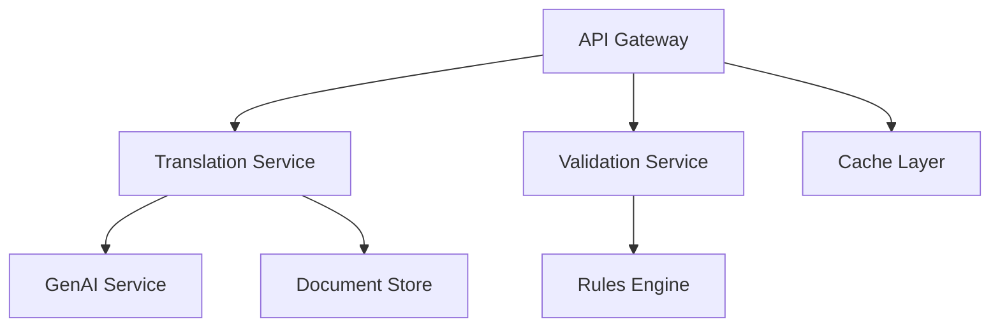

# Detection Translation Platform Backend

Enterprise-grade backend services for automated security detection translation between SIEM platforms and detection languages.


## Table of Contents
- [Overview](#overview)
- [System Architecture](#system-architecture)
- [Services](#services)
- [Security](#security)
- [Deployment](#deployment)
- [Monitoring](#monitoring)
- [Maintenance](#maintenance)
- [Development](#development)

## Overview

The Detection Translation Platform backend is a microservices-based system designed to provide high-performance, secure, and scalable detection translation capabilities. The system leverages custom-trained GenAI models to automate the translation of security detections between major SIEM platforms and detection languages.

### Key Features
- Automated detection translation between multiple formats
- High-fidelity translation with >95% accuracy
- Secure API gateway with robust authentication
- Scalable microservices architecture
- Comprehensive validation and error reporting
- GitHub integration for detection management

### Supported Formats
- Splunk SPL
- QRadar AQL
- SIGMA
- Microsoft Azure KQL
- Palo Alto Networks
- Crowdstrike NG-SIEM
- YARA
- YARA-L

## System Architecture

### High-Level Architecture

The backend system follows a microservices architecture pattern with the following core components:



### Service Communication
- REST APIs for client communication
- gRPC for inter-service communication
- RabbitMQ for asynchronous processing
- Redis for caching and rate limiting

### Data Flow
1. Client requests received through API Gateway
2. Authentication and authorization validation
3. Request routing to appropriate service
4. Translation/validation processing
5. Result storage and caching
6. Response returned to client

## Services

### API Gateway Service
Node.js-based service handling:
- Request routing and load balancing
- Authentication and authorization
- Rate limiting and throttling
- Request/response transformation
- API documentation (OpenAPI)

[API Gateway Documentation](./api-gateway/README.md)

### Translation Service
Python-based service providing:
- Detection format parsing
- GenAI model integration
- Translation processing
- Result validation
- Batch processing

[Translation Service Documentation](./translation-service/README.md)

### Validation Service
Go-based service offering:
- Rule syntax validation
- Format-specific verification
- Performance analysis
- Compatibility checking
- Error reporting

[Validation Service Documentation](./validation-service/README.md)

## Security

### Authentication & Authorization
- JWT-based authentication
- Role-Based Access Control (RBAC)
- OAuth 2.0 / OpenID Connect support
- API key management
- MFA for administrative access

### Data Security
- TLS 1.3 for all communications
- AES-256 encryption at rest
- Secure key management via AWS KMS
- Regular security audits
- Compliance with SOC 2 Type II

### Security Monitoring
- Real-time threat detection
- Anomaly detection
- Audit logging
- Security event alerting
- Incident response procedures

## Deployment

### Infrastructure Requirements
- Kubernetes 1.28+
- AWS EKS for container orchestration
- MongoDB 7.0+ for document storage
- Redis 7.2+ for caching
- RabbitMQ 3.12+ for messaging

### Local Development Setup
```bash
# Clone repository
git clone https://github.com/org/detection-translation-platform

# Install dependencies
cd detection-translation-platform/backend
make install

# Start local environment
docker-compose up -d
```

### Production Deployment
```bash
# Deploy to Kubernetes
kubectl apply -f k8s/

# Verify deployment
kubectl get pods -n detection-platform
```

## Monitoring

### Observability Stack
- Prometheus for metrics collection
- Grafana for visualization
- ELK Stack for log aggregation
- Jaeger for distributed tracing
- Datadog for APM

### Health Checks
- Kubernetes liveness probes
- Service health endpoints
- Dependency health monitoring
- Custom health metrics
- Automated recovery procedures

## Maintenance

### Routine Procedures
- Daily backup verification
- Weekly security patches
- Monthly performance review
- Quarterly capacity planning
- Annual disaster recovery testing

### Update Procedures
1. Review change requirements
2. Test in staging environment
3. Create deployment plan
4. Execute canary deployment
5. Monitor and verify
6. Document changes

## Development

### Prerequisites
- Docker 24.0+
- Node.js 20 LTS
- Python 3.11+
- Go 1.21+
- Make

### Environment Setup
```bash
# Configure development environment
make dev-setup

# Run tests
make test

# Build services
make build
```

### Contributing
1. Fork the repository
2. Create a feature branch
3. Implement changes
4. Add tests
5. Submit pull request

## License

Copyright © 2024 Detection Translation Platform

Licensed under the Apache License, Version 2.0

## Contact

- Platform Engineering Team
- Security Team
- [GitHub Repository](https://github.com/org/detection-translation-platform)

---
Version: 2.0.0  
Last Updated: 2024-01-20  
Documentation Standard: RFC 2119  
Review Cycle: Quarterly