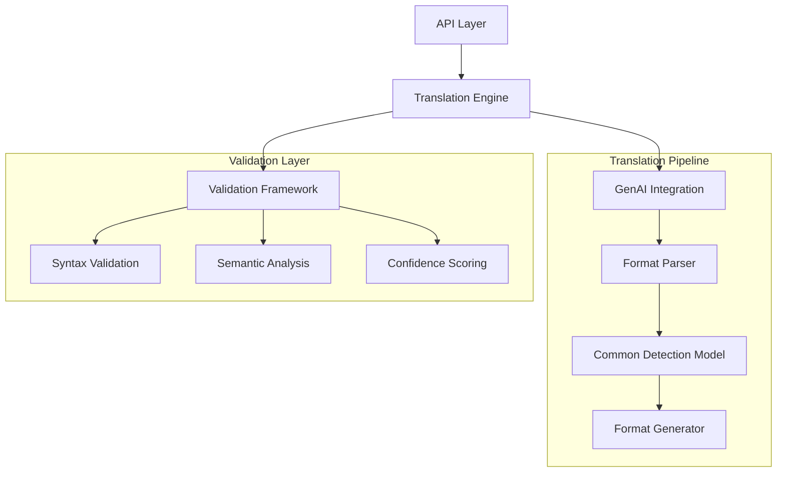
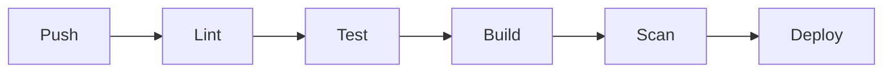

# Detection Translation Service

Enterprise-grade security detection translation service powered by GPT-4, enabling automated conversion between major SIEM platforms and detection languages.

## Overview

The Detection Translation Service is a high-performance Python-based microservice that leverages custom-trained GenAI models to automate the translation of security detections between different SIEM platforms and detection languages. This service is a core component of the AI-Driven Detection Translation Platform.

### Service Architecture



### Performance Characteristics

- Processing Capacity: 100+ translations/minute
- Average Response Time: <2 seconds for single translations
- Translation Accuracy: >95% success rate
- Memory Footprint: 4-8GB under load
- Concurrent Requests: Up to 1000 simultaneous connections

### Supported SIEM Platforms

- Splunk SPL
- QRadar AQL
- Microsoft Azure KQL
- SIGMA
- Palo Alto Networks
- Crowdstrike NG-SIEM
- YARA
- YARA-L

### Integration Points

- RESTful API endpoints
- Message queue integration (RabbitMQ)
- Prometheus metrics export
- Health check endpoints
- GitHub webhook support

## Features

### Core Capabilities

- Real-time detection rule translation
- Batch processing support
- Format-specific validation
- Translation confidence scoring
- Error explanation and suggestions
- Performance monitoring and metrics
- Automated syntax validation
- Cross-format field mapping

### AI Capabilities

- GPT-4 integration with custom fine-tuning
- Security-focused training corpus
- Format-specific optimizations
- Confidence scoring system
- Translation memory for improved accuracy
- Continuous learning pipeline
- Explainable translations

## Requirements

### System Requirements

| Component | Minimum | Recommended |
|-----------|---------|-------------|
| Python Version | 3.11+ | 3.11+ |
| CPU Cores | 2 | 4+ |
| Memory | 8GB | 16GB |
| Storage | 20GB | 50GB |
| Network | 100Mbps | 1Gbps |

### Dependencies

```toml
[dependencies]
fastapi = "^0.104.0"
uvicorn = "^0.23.2"
pydantic = "^2.4.2"
langchain = "^0.0.330"
openai = "^1.2.3"
prometheus-client = "^0.17.1"
pika = "^1.3.2"
python-jose = "^3.3.0"
python-multipart = "^0.0.6"
```

## Installation

### Local Development Setup

```bash
# Clone the repository
git clone <repository-url>
cd src/backend/translation-service

# Create virtual environment
python -m venv venv
source venv/bin/activate  # Linux/macOS
.\venv\Scripts\activate   # Windows

# Install dependencies
pip install -r requirements.txt

# Set up environment variables
cp .env.example .env
# Edit .env with your configurations

# Run development server
uvicorn app.main:app --reload
```

### Docker Deployment

```dockerfile
FROM python:3.11-slim

WORKDIR /app
COPY requirements.txt .
RUN pip install --no-cache-dir -r requirements.txt
COPY . .

CMD ["uvicorn", "app.main:app", "--host", "0.0.0.0", "--port", "8000"]
```

## Configuration

### Environment Variables

```env
# AI Model Configuration
OPENAI_API_KEY=your-api-key
MODEL_NAME=gpt-4
MAX_TOKENS=8192
TEMPERATURE=0.2

# Service Configuration
SERVICE_NAME=translation-service
LOG_LEVEL=INFO
BATCH_SIZE=100
MAX_CONCURRENT_TRANSLATIONS=50

# Security Configuration
JWT_SECRET_KEY=your-secret-key
API_KEY_HEADER=X-API-Key
ALLOWED_ORIGINS=["https://api.example.com"]

# Monitoring Configuration
ENABLE_METRICS=true
METRICS_PORT=9090
```

### Security Best Practices

- API key rotation every 90 days
- JWT token expiration: 1 hour
- Rate limiting: 100 requests/minute
- Input validation and sanitization
- Encrypted data storage
- Access control via RBAC
- Audit logging enabled

## API Documentation

### Translation Endpoints

#### Single Translation

```http
POST /api/v1/translate
Content-Type: application/json
Authorization: Bearer <token>

{
    "source_format": "splunk_spl",
    "target_format": "sigma",
    "content": "source=windows EventCode=4625"
}
```

#### Batch Translation

```http
POST /api/v1/translate/batch
Content-Type: application/json
Authorization: Bearer <token>

{
    "source_format": "splunk_spl",
    "target_format": "sigma",
    "detections": [
        {
            "id": "detection-1",
            "content": "source=windows EventCode=4625"
        }
    ]
}
```

### Response Format

```json
{
    "id": "trans-123",
    "status": "success",
    "confidence": 0.95,
    "result": {
        "content": "title: Failed Windows Login\nstatus: experimental\nlogsource:\n    product: windows\n    service: security\ndetection:\n    selection:\n        EventID: 4625",
        "validation": {
            "syntax_valid": true,
            "semantic_valid": true,
            "warnings": []
        }
    }
}
```

## Development

### Code Standards

- PEP 8 compliance
- Type hints required
- Docstring documentation
- Unit test coverage >90%
- Integration test coverage >80%
- Pre-commit hooks enabled

### Testing

```bash
# Run unit tests
pytest tests/unit

# Run integration tests
pytest tests/integration

# Generate coverage report
pytest --cov=app tests/
```

### CI/CD Pipeline



## Contributing

1. Fork the repository
2. Create a feature branch
3. Implement changes with tests
4. Submit pull request
5. Pass code review
6. Merge to main branch

## License

Copyright (c) 2023. All rights reserved.

## Support

- Documentation: `/docs`
- Issues: GitHub Issues
- Slack: #translation-service
- Email: support@example.com